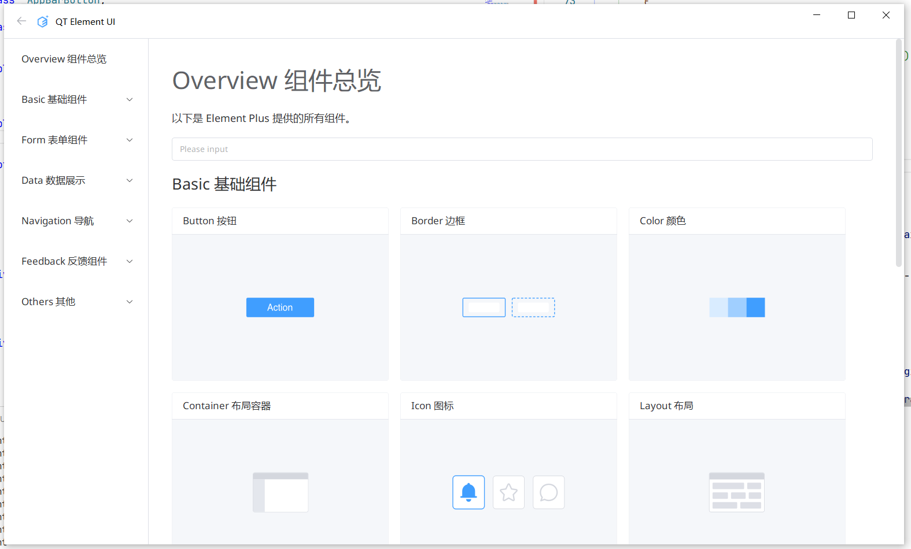
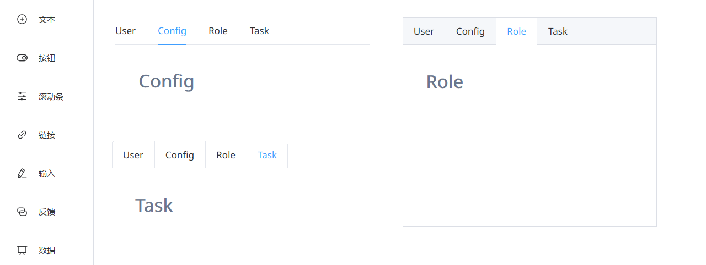

# qt-element-ui

目前使用 C++ Qt 5.14 版本，模拟实现 Web 组件库 Element Plus ( Element UI ) 的相关控件。

> 本人使用的是缩放比例为125%的2k显示器。可能没有照顾到其他缩放比例，有些控件尺寸可能略大。
>
> 为开源生态贡献一份力量是我一直以来的目标，虽实力有限，仍不断前进。

#### 编译方法

1. cmake

```
mkdir -p build && cd build
cmake .. -G \"MinGW Makefiles\" -DCMAKE_CXX_COMPILER=g++ && make -j16
./qt-element-ui
```

2. qmake

```
mkdir -p build && cd build
qmake.exe ../qt-element-ui.pro && $(MAKE) -j16
cd release && ./qt-element-ui
```

#### 实际效果



---


---


---


---


---


---


---


---


---



#### 代码规范

1. 成员变量命名以_开头，声明默认值时使用=。
2. getter、setter方法名需以get、set开头。
3. 设计接口要考虑到使用场景，比如水印要提供setWatermark的静态方法，以便其他控件设置水印背景。
4. 字体统一从utils.h的FontHelper::getFont获取，字号等需和已有控件保持一致。